# Pokemon_Scraper-API

<em>Will Huang</em>
 
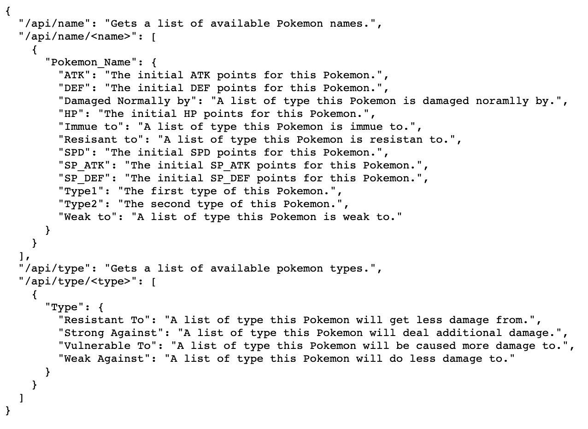

## Project Summary
<ol>
  <li>
    This project is an <strong>API</strong> providing the Pokemon Information and the Pokemon Type Effectiveness. 
  </li>
  <li>
    To begin I create a <strong>MongoDB</strong> as the database system to store the Pokemon Dataset. 
  </li>
  <li>
    Next, I used a <strong>Jupyter Notebook</strong> for the crawling process.
  </li>
  <li>
    Next, I utilized <strong>Pymongo</strong> to import the Pokemon Dataset into MongoDB.
  </li>
  <li>
    Lastly, I used <strong>Flask</strong> server to build the API function.
  </li>
  <li>
    From that point I am able to retrieve the information by using the Pokemon API.
  </li>
</ol>

## How to Run
### Setup Database

For the database, this project uses a MongoDB database for storing Pokemon data.
This database needs to be created and populated by following the steps below.

#### Create Database and Collection(Table)

<ol>
  <li>
    Open an instance of <strong>Command Prompt</strong> (for windows) or <strong>Terminal</strong> (for mac). 
  </li>
  <li>
	Run <strong>"mongo"</strong> to initiate the MongoDB shell.
    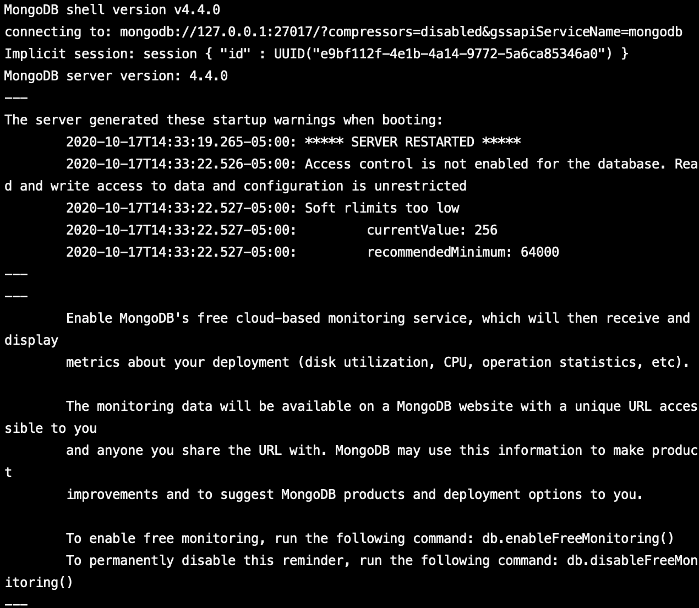
  <li>
    Run <strong>"use Pokemon_DB"</strong> to create a database. 
    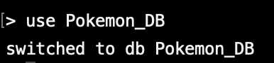
  </li>
   <li>
    Run <strong>"db.createCollection("Pokemon_Table")"</strong> to create a collection. 
    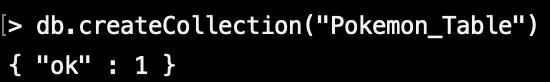
  </li>
</ol>

### Crawl Data and Populate Database

To populate the database, a Jupyter Notebook has been written that goes over the crawling process for the Pokemon data and populate database into MongoDB.

#### Use Jupyter Notebook
<ol>
  <li>
    Run a <strong>Command Prompt</strong> (for windows) or <strong>Terminal</strong> (for mac).
  </li>
  <li>
    In the termanal run "jupyter notebook", which will open a Jupyter Notebook in the browser.
  </li>
  <li>
    Run <strong>Pokemon_Info_Crawler.ipynb</strong> in the Jupyter Notebook.
  </li>
  <li>
    With the code open, you have two options on how to run the code:
    <ul>
      <li>
        In the menu bar open Kernel > Restart and Clear Output.  Then you can use Shift+Enter to run the code one block at a time.
      </li>
      <li>
        In the menu bar open Kernel > Restart and Run All.  This will run all of the blocks of code at once.
      </li>
    </ul>
  </li>
  The last dialog should show something like this if the crawlering and ETL process have been run successfully: 
  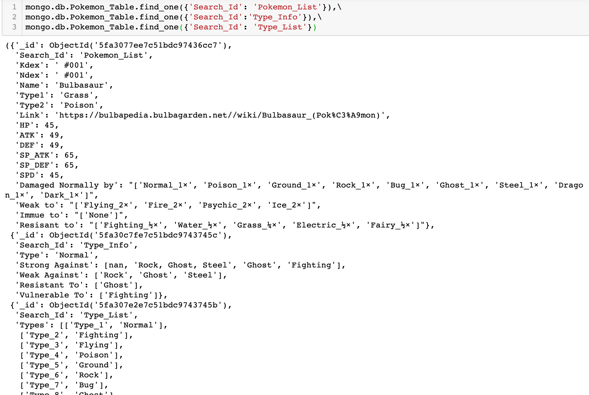
</ol>

### Setup Web Server

#### Utilize Flask as Web Server

<ol>
  <li>
    Run a <strong>Command Prompt</strong> (for windows) or <strong>Terminal</strong> (for mac).
  </li>
  <li>
    Change the directory in the terminal to the root directory of this project.
  </li>
  <li>
    Run <strong>“python app.py”</strong>. In the output of the command, there should be a URL hosted on your computer to access.  Use Google Chrome to open that URL.
     The output should look like this: 
    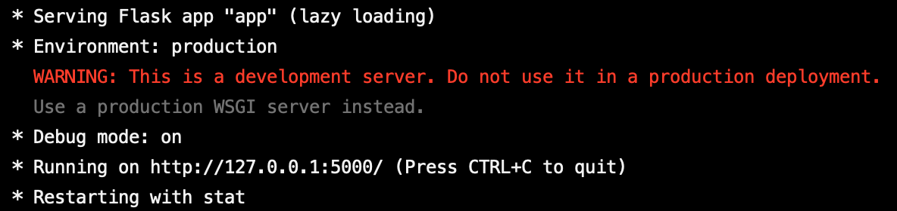
  </li>
</ol>

## API
After finishing the <strong>How to Run section</strong>, the server should be running and the database should be populated.  The server should be running from a URL outputted in the <strong>Utilize Flask as Web Server section</strong>. This URL will be the localhost URL.

### Browsing the API

<ol>  
  <li>
    Open a browser and enter the localhost URL to go to the homepage.
  </li>
  <li>
    You should see a webpage similar to the below screenshot: 
    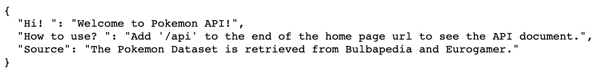
  </li>
  <li>
    Add the '/api' to the end of the homepage url. You will see the API document on the screen. 
    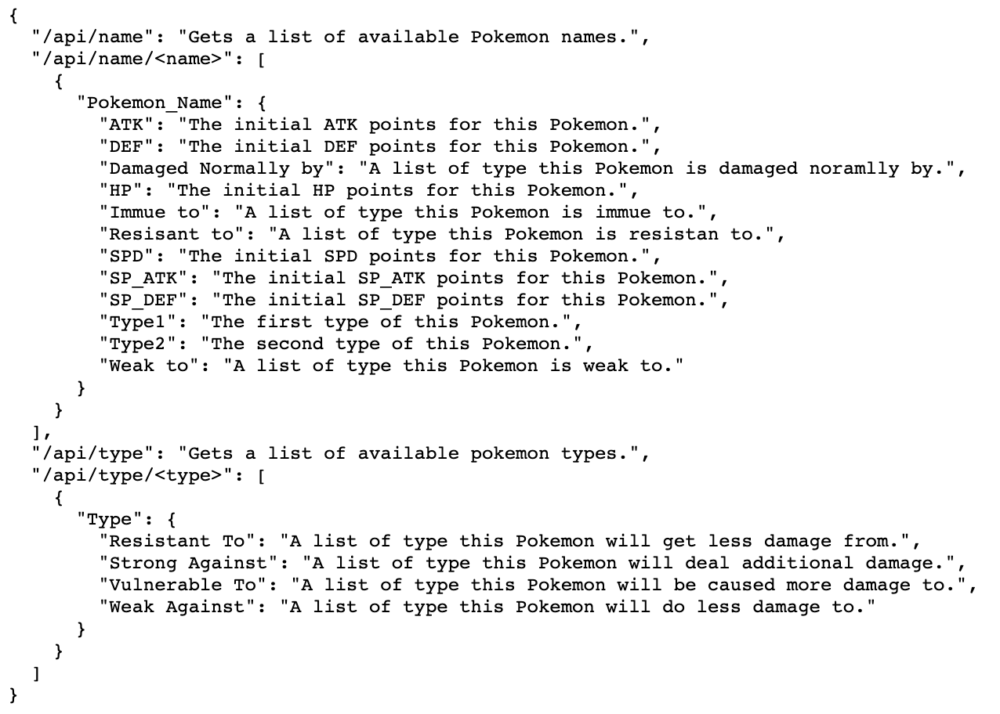
  </li>
</ol>
<ul>
    <li>
        Add the '/api/name' to the end of the homepage url to see a list of all available names. 
        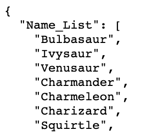
    </li>
    <li>
        Add the '/api/name/_a_name_' to the end of the homepage url to see the information for particular pokemon. 
        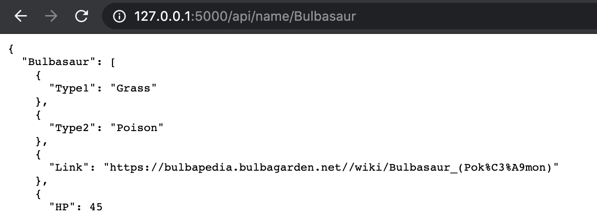
    </li>
    <li>
        Add the '/api/type' to the end of the homepage url to see a list of all available types. 
        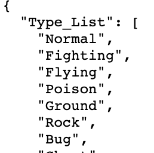
    </li>
    <li>
        Add the '/api/name/_a_type_' to the end of the homepage url to see the effectiviness for particular type 
        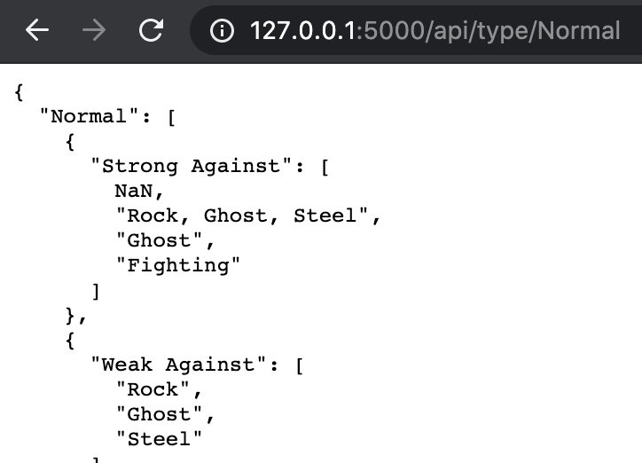
    </li>
</ul>

## Sources

<li>
    <strong>Bulbapedia</strong> (https://bulbapedia.bulbagarden.net)
</li>
<li>
   <strong>Eurogamer</strong> (https://www.eurogamer.net/articles/2018-12-21-pokemon-go-type-chart-effectiveness-weaknesses)
</li>
